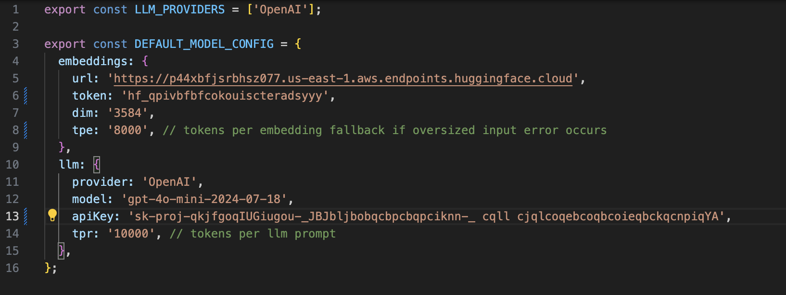
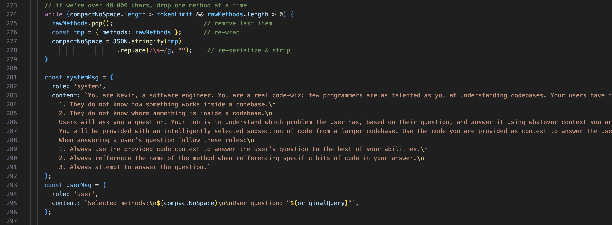

# Purple Search


# Demo Video

[](https://youtu.be/aglrXDLoOhQ)

# Purpose

We are a small group of undergads interested in building human in the loop coding agents. When building different code search functionalities for agents it is useful to experiemnt with different embedding models and see what works best for a given use case. We created this framework and GUI to experiment and compare different embedding models so that you can better understand their strengths and weaknesses. This tool lets you quickly deploy any open source embedding model on hugging face into a real application. 

note: This tool might be a little rough around the edges and occasioanlly get hung up. It hasnt been fully tested for use outside of our small group. We hope that it is useful to someone out there... if so feel free branch off and add to this code in any way that you like and make it into whatever suits you best. PRs welcome.

## Warning
This code only handles Java code right now. Other languages seen wont break it they will just be ignored.

## Overview

Here's the high-level flow:

⬇ Choose a local file to be proscessed

⬇ Choose what embedding model and LLM to perform search with

⬇ Click 'Create new search space'

⬇ We parse and genrate a rich graph representation of your selected file

⬇ We generate embeddings of code within the graph and store it in a vector db (built into neo4j)

⬇ Query into this vector db and retreive the most relevant code snippets.

⬇ Collect each code snippet from the graph and its surrounding surrounding elements 

⬇ send each subgraph to an LLM to be explained in relation to your query

## Quick Deployment

If you have run this project before Run npm start on the project root. 

```
npm start
```
If you are running this for the first time, go through Setup.

## Setup

### 1. Install Java & Maven

```
brew install openjdk
brew install maven
```

We use these for the backend, which are the files under `/src`.

### 2. Install node.js

```
brew install node
```

We use this to run npm scripts.

### 3. Create venv 
```
python3 -m venv venv
source venv/bin/activate   # On Windows: venv\Scripts\activate
pip install -r requirements.txt 
```

This is used to run a python script that generates embeddings located @ src/gen/Embed.py

### 3. Install Neo4j (or have access to a Neo4j DBMS)

You will need to have access to a Neo4j DBMS and provide the **URL**, **Username**, and **Password** to the program. Neo4j is what allows us to store and query graph format data really fast.
Download the [free desktop app here](https://neo4j.com/download/?utm_source=GSearch&utm_medium=PaidSearch&utm_campaign=Evergreen&utm_content=AMS-Search-SEMBrand-Evergreen-None-SEM-SEM-NonABM&utm_term=download%20neo4j&utm_adgroup=download&gad_source=1&gad_campaignid=20973570622&gbraid=0AAAAADk9OYr0EgqTN6cPo-zJgZceR3eUZ&gclid=Cj0KCQjwlMfABhCWARIsADGXdy8fZK2RwxqC6nLMj0axTVnujb1zSRcaXsc5WVSQm8wJcwYgJEfBI-MaAge5EALw_wcB)


### 4. Run `npm install` on the root directory
```
npm install
```

### 5. Run `npm install` on the front end

```
cd frontend
npm install
```

This gets the seperate front end specific dependencies

### 6. Run `npm start` from teh root to run the program

```
cd ..
npm start
```

# Tips

### How to prefill your model configs

Re-entering your model configs can get tiring. Especially if you are only experimenting with changing a small number of configs.

Navigate to `frontend/src/modelConfig.js` Here you can prefill your config values. So they are filled at launch.



### How to adjust your LLM system prompt

Have a different use case in mind? Navigate to `frontend/src/SecondScreen.js` and Adjust your LLM system prompt. Keep in mind that your system prompt contributes to prompt size and can cause oversized input errors.



### logs require manual cleaning

Log files that get filled by each execution are `loading.log` (captures graph creation and embedding status and is streamed to the loading screen) and `scrape_errors.log` (shows you all items from the code that confused our lightweight java parser HAVING ALOT OF ERRORS IS OK).

These logs are simple write tos and you gotta clean em every so often. Bcuz logs from multiple days will stack up. 


